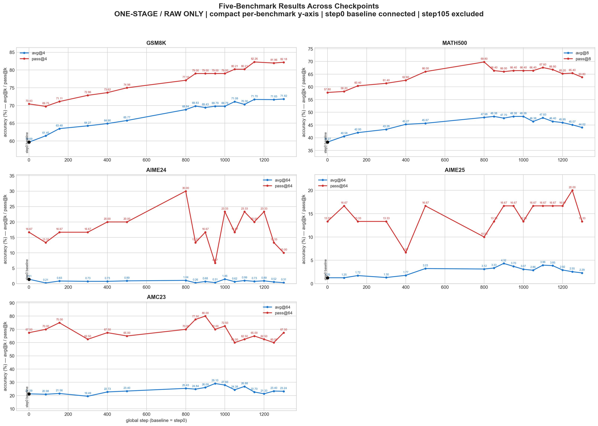

# Benchmark Results

This chart uses the one-stage/raw generation results with the official flower prompt. The original `g1i` model is shown as `step0` baseline; `step105` is excluded as requested. `avg@k` and `pass@k` are kept separate.

| Checkpoint | GSM8K avg@4 / pass@4 | MATH500 avg@8 / pass@8 | AIME24 avg@64 / pass@64 | AIME25 avg@64 / pass@64 | AMC23 avg@64 / pass@64 |
|---|---:|---:|---:|---:|---:|
| step0 (g1i baseline) | 59.69% / 70.43% | 38.28% / 57.80% | 1.41% / 16.67% | 1.25% / 13.33% | 21.29% / 67.50% |
| step85 | 61.45% / 69.75% | 40.58% / 58.20% | 0.21% / 13.33% | 1.25% / 16.67% | 20.98% / 70.00% |
| step155 | 63.48% / 71.11% | 42.00% / 60.40% | 0.83% / 16.67% | 1.72% / 13.33% | 21.56% / 75.00% |
| step300 | 64.27% / 72.86% | 43.28% / 61.40% | 0.73% / 16.67% | 1.30% / 13.33% | 19.49% / 62.50% |
| step400 | 64.90% / 73.62% | 45.27% / 62.60% | 0.73% / 20.00% | 1.77% / 6.67% | 22.73% / 67.50% |
| step500 | 65.77% / 74.98% | 45.67% / 66.00% | 0.89% / 20.00% | 3.23% / 16.67% | 23.40% / 65.00% |
| step600 | — | — | 0.83% / 16.67% | 2.55% / 16.67% | 23.95% / 65.00% |
| step800 | 68.84% / 77.10% | 47.98% / 69.80% | 1.04% / 30.00% | 3.12% / 10.00% | 25.43% / 70.00% |
| step850 | 69.83% / 78.17% | 49.08% / 69.20% | 0.26% / 13.33% | 3.33% / 13.33% | 24.84% / 77.50% |
| step900 | 69.43% / 79.00% | 47.70% / 66.00% | 0.68% / 16.67% | 4.32% / 16.67% | 26.09% / 80.00% |
| step950 | 69.79% / 79.38% | 48.20% / 67.60% | 0.31% / 6.67% | 3.70% / 16.67% | 29.10% / 70.00% |
| step1000 | 69.79% / 79.00% | 48.38% / 66.40% | 1.46% / 23.33% | 3.07% / 13.33% | 27.93% / 72.50% |
| step1050 | 71.08% / 80.21% | 46.38% / 66.40% | 0.62% / 16.67% | 2.86% / 16.67% | 24.38% / 60.00% |
| step1100 | 70.30% / 80.21% | 47.83% / 67.60% | 0.99% / 23.33% | 3.96% / 16.67% | 26.88% / 62.50% |
| step1150 | 71.70% / 82.26% | 46.40% / 66.80% | 0.73% / 20.00% | 3.85% / 16.67% | 22.70% / 65.00% |
| step1200 | — | 45.95% / 65.20% | 0.89% / 23.33% | 2.92% / 16.67% | 21.33% / 62.50% |
| step1250 | 71.65% / 81.96% | 45.07% / 65.40% | 0.52% / 13.33% | 2.55% / 20.00% | 23.40% / 60.00% |
| step1300 | 71.82% / 82.18% | 44.02% / 63.80% | 0.31% / 10.00% | 2.29% / 13.33% | 23.24% / 67.50% |

Evaluation sizes: GSM8K `1319 x 4`, MATH500 `500 x 8`, AIME24/AIME25 `30 x 64`, and AMC23 `40 x 64`.
